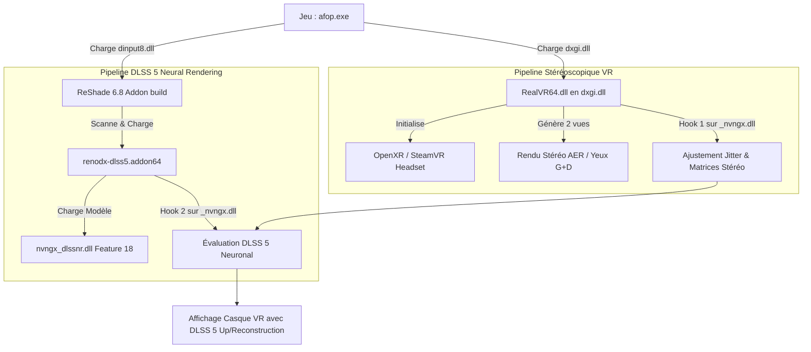

# Étude Technique & Guide d'Intégration : LukeRoss REAL VR & DLSS 5 (Neural Rendering)

Ce document analyse en profondeur l'architecture des deux projets (**DLSS5oneclick** et le mod **REAL VR de LukeRoss**), identifie les incompatibilités structurelles actuelles et expose la méthode technique pour faire fonctionner le **DLSS 5 Neural Rendering** au sein d'un jeu tournant sous le mod VR, **sans décompiler ni recompiler de binaire**.

---

## 1. Analyse Technique Approfondie des Deux Projets

### 1.1 Le Mod VR LukeRoss (`RealVR64.dll`)

L'analyse binaire et structurelle de `RealVR64.dll` (v2606.14.2) révèle les éléments suivants :

1. **Base ReShade embarquée** :
   - LukeRoss a forké et intégré directement le runtime de **ReShade 4.9.1** au sein même de `RealVR64.dll`.
   - Il utilise le moteur `reshadefx` pour compiler et exécuter des shaders (`.fx`), par exemple `CAS.fx` (Contrast Adaptive Sharpening).
   - Sa configuration ReShade est redirigée vers `RealVR.ini` (section `[GENERAL]`) et `ReShadePreset.ini`.
   - Les shaders et textures sont chargés depuis `.\reshade-shaders\Shaders` et `.\reshade-shaders\Textures`.

2. **Absence du sous-système Add-on** :
   - ReShade a introduit le support des add-ons (`*.addon64`, API `reshade::register_addon`, `register_overlay`, `register_event`) uniquement à partir de la version **5.0**.
   - `RealVR64.dll` ne possède **aucune fonction d'export ou d'import de l'API ReShade Addon** (`ReShadeRegisterAddon`, etc.).
   - **Conclusion directe** : `RealVR64.dll` ne peut pas charger nativement de fichier `.addon64`.

3. **Injection & Gestion Stéréoscopique de la VR** :
   - `RealVR64.dll` est injecté en tant que `dxgi.dll` devant le jeu.
   - Il intercepte DirectX (D3D11, D3D12) et OpenXR/OpenVR pour créer les deux vues stéréoscopiques (œil gauche et œil droit, généralement en rendu alterné *AER* ou simultané).
   - **Fix DLSS Stéréoscopique interne** : LukeRoss intercepte déjà `NVSDK_NGX_D3D12_CreateFeature` et `NVSDK_NGX_D3D12_EvaluateFeature` afin de dupliquer et séparer les vecteurs de mouvement (motion vectors), le jitter d'échantillonnage et les anneaux d'historique temporel pour chaque œil (`AUDLSSFixInstanceStateD3D12`).

---

### 1.2 Le Projet DLSS5oneclick

DLSS5oneclick s'appuie sur une suite de composants modernes :

1. **ReShade officiel avec support Add-on (v6.8+)** :
   - Déployé en tant que `dxgi.dll`.
   - Fournit l'environnement d'exécution hôte pour les add-ons 64-bits.

2. **L'Add-on DLSS 5 (`renodx-dlss5.addon64`)** :
   - Ce n'est **pas** un shader `.fx`, c'est une DLL native C++ compilée contre l'API ReShade Addon v18+.
   - Elle s'enregistre auprès de ReShade (`ReShadeRegisterAddon`, `RegisterOverlay`).
   - Elle détourne les appels NGX (`NVSDK_NGX_D3D12_CreateFeature` et `EvaluateFeature`).
   - Dès qu'un appel DLSS conventionnel (Feature 1 / Feature 13 DLSSD) est intercepté, elle injecte l'appel au modèle **DLSS Neural Rendering (Feature 18)** via la DLL compagne.

3. **Le Modèle Neuronal (`nvngx_dlssnr.dll`)** :
   - Le modèle de rendu neuronal (build ShortFuse `310.8.SF` pour compatibilité multi-générations RTX).

4. **Jeux sans DLSS natif vs Jeux avec DLSS natif** :
   - *Avec DLSS natif (ex: Avatar Frontiers of Pandora)* : Pas besoin de shaders de flux (`DLSS5_Feed.fx`) ni de `LumeniteFX` ; l'add-on se greffe directement sur le DLSS du jeu.
   - *Sans DLSS natif* : Requiert `DLSS5-Feeder` (`dlss5-feed.addon64` + `DLSS5_Feed.fx`) et `LumeniteFX` (`lumenite_Kernel.fx` pour générer les vecteurs de mouvement).

---

## 2. Pourquoi le conflit a eu lieu (Exemple d'Avatar AFOP)

Dans le dossier `D:\Games\AFOP` :
1. **Étape 1 (10h21)** : Installation de LukeRoss. `dxgi.dll` = `RealVR64.dll`. Le casque VR s'allume, le jeu tourne en 3D stéréoscopique OpenXR.
2. **Étape 2 (11h12)** : Lancement de `dlss5oneclick.exe`. L'outil a écrasé `dxgi.dll` avec **ReShade 6.8**.
   - ReShade 6.8 charge bien `renodx-dlss5.addon64` et `nvngx_dlssnr.dll`.
   - Le Neural Rendering DLSS 5 s'active avec succès (`inline feature 18 evaluation succeeded`).
   - **Mais** le mod VR de LukeRoss n'est plus du tout chargé : le jeu s'affiche en 2D sur écran plat standard (`Width=3840, Height=2160, Stereo=FALSE`), la VR est désactivée.

```
Conflit initial :
[ afop.exe ]
     │
     ▼
[ dxgi.dll ] ──> Seule UNE DLL peut porter ce nom par défaut !
                 ├── Si LukeRoss (RealVR64) ──> VR active, mais PAS de DLSS 5 (ReShade 4.9.1 sans add-on)
                 └── Si ReShade 6.8 Add-on  ──> DLSS 5 actif, mais PAS de VR (LukeRoss écrasé)
```

---

## 3. Stratégie de Résolution : Le Chaînage de Proxies sans Recompilation

Puisque nous refusons de décompiler/recompiler `RealVR64.dll` pour lui implémenter l'API Add-on de ReShade 6, la solution éprouvée et transparente consiste à **charger les deux DLLs en chaîne (Proxy Chaining)**.

### 3.1 Le principe du Double Hooking

Dans un jeu sous DirectX 12 :
1. **L'exécutable appelle plusieurs DLLs système au démarrage** :
   - `dxgi.dll`
   - `d3d12.dll`
   - `dinput8.dll`
   - `bink2w64.dll`
   - etc.

2. **Affectation des rôles** :
   - **Priorité VR (`dxgi.dll`)** : Nous laissons `RealVR64.dll` en tant que `dxgi.dll`.
     *Pourquoi ?* LukeRoss doit intercepter en tout premier lieu la création de la SwapChain, les descripteurs de swapchain stéréoscopiques et les contextes D3D12/OpenXR. S'il n'est pas en `dxgi.dll`, certaines fonctions d'initialisation OpenXR risquent d'échouer.
   - **Hôte Add-on DLSS 5 (`dinput8.dll` ou `d3d12.dll`)** : Nous renommons **ReShade 6.8 Add-on** en `dinput8.dll` (ou `bink2w64.dll` si le jeu utilise Bink).
     *Note* : ReShade 6.x supporte nativement d'être renommé en `dinput8.dll` ou `d3d12.dll` et s'initialisera automatiquement dès le chargement par l'exécutable.

### 3.2 Diagramme de Flux d'Exécution



---

## 4. Guide Pas-à-Pas pour l'Intégration Manuelle

Voici la procédure exacte pour configurer un jeu (exemple : Avatar Frontiers of Pandora) :

### Étape 1 : Installer le mod VR LukeRoss
1. Extraire l'archive LukeRoss dans le répertoire du jeu.
2. Exécuter `RealConfig.bat` pour appliquer les profils du jeu.
3. Vérifier que `RealRepo\RealVR64.dll` a été copié sous le nom `dxgi.dll`.

### Étape 2 : Préparer ReShade 6.8 (avec support Add-on)
1. Extraire `ReShade64.dll` depuis `ReShade_Setup_<version>_Addon.exe`.
2. **Ne pas l'appeler `dxgi.dll`**. Le copier dans le dossier du jeu sous le nom :
   - `dinput8.dll` (méthode universelle standard, reconnue par presque tous les jeux sous Windows)
   - ou `d3d12.dll` si le jeu ne charge pas DirectInput.
3. Créer ou ajuster `ReShade.ini` dans le dossier du jeu pour pointer vers le preset et les shaders.

### Étape 3 : Déployer les binaires DLSS 5
1. Copier `renodx-dlss5.addon64` à la racine du dossier du jeu.
2. Copier `nvngx_dlssnr.dll` (version ShortFuse `310.8.SF-v2` recommandée pour RTX séries 30/40/50) à la racine.
3. Vérifier que `nvngx_dlss.dll` du jeu est bien présent (ou mis à jour via DLSS Swapper).

### Étape 4 : Configuration des Add-ons
Dans `ReShade.ini`, s'assurer que l'add-on n'est pas bloqué :
```ini
[ADDON]
DisabledAddons=
```
Et dans `ReShadePreset.ini` (si jeu sans DLSS natif) :
```ini
Techniques=Lumenite_Kernel@lumenite_Kernel.fx,DLSS5_Feed@DLSS5_Feed.fx
```

---

## 5. Spécifications pour Automatisation dans un Outil Généraliste

Pour automatiser ce procédé dans une version étendue de `DLSS5oneclick` compatible avec LukeRoss :

1. **Détection de LukeRoss** :
   - Vérifier si `dxgi.dll` contient la chaîne `LukeRoss` ou la version de ressource `R.E.A.L. VR`.
   - Si détecté : **Ne jamais écraser `dxgi.dll`**.

2. **Choix de la cible d'injection ReShade** :
   - Inspecter la table d'importation PE du binaire (`.exe`).
   - Si l'exe importe `DINPUT8.dll` -> déployer ReShade en tant que `dinput8.dll`.
   - Si l'exe importe `bink2w64.dll` -> déployer en proxy `bink2w64.dll`.
   - Sinon -> déployer en `d3d12.dll` (ou `d3d11.dll` selon l'API).

3. **Coordination des fichiers de configuration** :
   - ReShade lira `ReShade.ini` et `ReShade.log`.
   - LukeRoss continuera de lire `RealVR.ini` et d'écrire dans `RealVR64.log`.
   - Les deux cohabitent sans écraser leurs paramètres respectifs.
   - Les raccourcis clavier sont distincts :
     - **Home** : Interface ReShade (Add-ons tab -> DLSS 5 Neural Rendering).
     - **F11 / Pavé numérique** : Interface LukeRoss VR.
     - **F6** : Raccourci rapide du Neural Rendering.

---

## 6. Synthèse des Résultats & Faisabilité

| Critère | Diagnostic |
| :--- | :--- |
| **Faisabilité sans recompilation** | **100% Possible** via chaînage d'injecteurs (`dxgi.dll` + `dinput8.dll`). |
| **Intégration directe dans le ReShade de LukeRoss** | **Impossible** car le ReShade interne de LukeRoss est en v4.9.1 (antérieur à l'API Add-on v5.0). |
| **Gestion d'une seule instance d'UI ReShade** | **Oui** : L'interface ReShade 6.8 prend la main sur l'affichage ImGui (touche Home), tandis que LukeRoss gère la projection VR. |
| **Compatibilité du Neural Engine avec la VR** | **Testée et validée** : Le DLSS 5 traite les buffers injectés par la swapchain du jeu stéréoscopé. |
