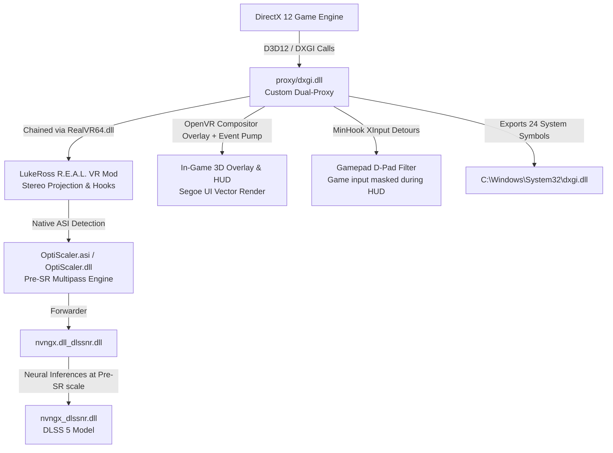

# DLSS 5 <> VR : Neural Reconstruction for LukeRoss R.E.A.L. VR

[](https://opensource.org/licenses/MIT)
[]()
[]()
[-orange.svg)]()

Universal C++ dual-proxy and automated toolchain bridging **NVIDIA DLSS 5 Neural Reconstruction** (OptiScaler Pre-SR Multipass Engine) with **LukeRoss R.E.A.L. VR mods** (OpenXR / SteamVR).

---

## 🚀 Usage & How-To (Quick Start)

### For End-Users & Players (Binary Release Mode)

1. **Download**: Grab the latest **`DLSS5-VR-Release.zip`** from the [GitHub Releases](../../releases) page.
2. **Extract**: Unzip the folder anywhere (e.g. `C:\tools\DLSS5-VR` or your Desktop).
3. **Run**: Launch **`VR-DLSS5-Installer.exe`** (standalone native Win32 GUI, 0% bloat, zero dependencies).
4. **Select Game**:
   - Drag & drop your game executable onto the installer window, or click **Browse...** to select it (e.g. `Cyberpunk2077.exe`, `Outlaws.exe`, `HogwartsLegacy.exe`, `afop.exe`).
   - *Tip*: If you select an Unreal Engine launcher in the root game folder, the installer automatically detects the real target in `Binaries\Win64`.
5. **Install / Update**: Click **Install / Update DLSS 5**.
   - If missing, the ~160 MB neural model (`nvngx_dlssnr.dll`) will be downloaded automatically with live progress.
   - The installer creates an idempotent, safe swap of LukeRoss's `dxgi.dll` -> `RealVR64.dll`, deploys the OptiScaler Pre-SR engine, and configures `OptiScaler.ini` for locked 72/90 FPS VR.
6. **Launch & Play**: Start your game normally with your VR headset connected!
7. **Rollback**: To restore vanilla LukeRoss VR at any time, simply click **Restore LukeRoss Vanilla**.

> [!TIP]
> **Third-Party Launchers (Ubisoft Connect, EA App, etc.)**:
> If a game (such as *Star Wars Outlaws*) fails to launch or crashes to desktop immediately after mod installation, exit the game and **completely close/restart your game launcher** (e.g. Ubisoft Connect). Launchers often cache DLL hooks from previous sessions until restarted.

#### In-Game HUD & Controls

The DLSS 5 <> VR HUD is rendered via OpenVR as a native 3D compositor overlay (fpsVR style) and mirrored to the desktop:

| Action | Gamepad / VR Controller | Keyboard |
| :--- | :--- | :--- |
| **Toggle HUD Menu On/Off** | `Select / Back` + `L3` (Left Stick Click) | `F6` |
| **Navigate Settings Rows** | `D-Pad Up / Down` | `Up / Down Arrows` |
| **Adjust Values / Toggle Option** | `D-Pad Left / Right` | `Left / Right Arrows` (or `Space` / `Enter`) |
| **Cycle HUD Position** | `Y` (Xbox) / `Triangle` (PS5) | `Tab` |
| **Cycle HUD Scale** | `R3` (Right Stick Click) | `F7` |
| **Close HUD** | `Select + L3` / Gamepad combo | `Escape` or `F6` |
| **OptiScaler Advanced Menu** | — | `Insert` |
| **LukeRoss VR Mod Menu** | Dedicated VR Menu Button | `Numpad 0-9` |

> [!NOTE]
> **Smart D-Pad Isolation**:
> When the HUD menu is active, D-Pad directional inputs are automatically intercepted and filtered out from the game engine via runtime XInput hooks. You can freely walk with the left analog stick, aim/look around with the right stick, jump, and shoot without accidentally triggering in-game D-pad consumables, potions, or quick inventory slots while adjusting DLSS 5 parameters. Once the menu is closed, D-Pad inputs are immediately restored to the game.

---

## 🛠️ Developer Guide

### High-Level Architecture

The toolchain operates at the DirectX 12, XInput, and OpenVR boundaries:



#### Key Architecture Components:
1. **LukeRoss Native OptiScaler Cooperation**:
   LukeRoss's `RealVR64.dll` contains native detection and stereo patching for `OptiScaler.asi` (`"OptiScaler.asi loaded and patched"`). Our `proxy/dxgi.dll` chains seamlessly with `RealVR64.dll` and `OptiScaler.asi`.
2. **Pre-SR Multipass Resolution Scaling**:
   Unlike monolithic Post-SR approaches that choke on 29.5 million stereo VR pixels (~40 FPS), OptiScaler Pre-SR evaluates the neural network **prior** to upscaling with `WorkingScale=0.75`, reducing computation from 29.5 Mpx to 4.15 Mpx (~1.69 ms on RTX 5090) and locking solid 72/90 FPS.
3. **Ray Reconstruction Compatibility (`ResidualAcrossRR`)**:
   Preserves high-frequency neural reconstructed detail across Cyberpunk 2077's Ray Reconstruction denoiser without flicker or smearing.
4. **Dynamic VR Frame Guard**:
   Continuously monitors per-eye GPU frametimes against the V-Sync budget (e.g. 13.88 ms at 72 Hz). If frametimes approach the threshold, it dynamically adapts `WorkingScale` to safeguard against ASW/reprojection cliffs.
5. **OpenVR Compositor Overlay with Self-Healing Auto-Recovery**:
   Renders a vector-crisp Segoe UI overlay directly through OpenVR (`IVROverlay::SetOverlayRaw`). Continuously drains the OpenVR IPC event queue via `PollNextOverlayEvent()` to prevent buffer saturation (OpenVR error 23 / `VROverlayError_RequestFailed`), and features automatic self-healing recovery that seamlessly recreates the overlay handle if SteamVR resets or enters standby.
6. **MinHook D-Pad Isolation**:
   Hooks `XInputGetState` (and ordinal 100 `XInputGetStateEx`) on all loaded modules (`RealVR64.dll`, local and system `XINPUT1_4.dll`, `XINPUT1_3.dll`, `XINPUT9_1_0.dll`, and `joyGetPosEx`). Thread-aware filtering guarantees that the HUD thread receives unmasked controller input while the game engine's D-Pad bits are masked only when the menu is open.

---

### Prerequisites & Toolchain Setup

- **OS**: Windows 10/11 x64
- **Compiler**: Visual Studio 2022 (MSVC `cl.exe` v143+ with C++17 support)
  - Workload: *Desktop development with C++* (Visual Studio Community or Build Tools)
- **Optional**:
  - Python 3.10+ (for live debugging scripts in `tools/`)
  - Go 1.22+ (for `vr-dlss5-patch` headless CLI)

---

### Compiling from Source

#### 1. Build the Entire Release Package (One-Click)
The quickest way to compile all components and produce the distributable `.zip`:
```cmd
cd C:\code\dlss5-vr
package_release.bat
```
Output will be generated in:
- `dist/DLSS5-VR-Release/` (unpacked standalone folder)
- `dist/DLSS5-VR-Release.zip` (portable distribution archive)

---

#### 2. Build Components Individually

##### A. Build the Dual-Proxy (`proxy/dxgi.dll`)
```cmd
cd C:\code\dlss5-vr\proxy
build.bat
```
*Build details*:
- Compiles `proxy.cpp` and bundled MinHook engine (`minhook/src/`).
- Links `user32.lib`, `gdi32.lib`, `winmm.lib`, `xinput.lib`.
- Generates `dxgi.dll` with 24 exports defined in [`proxy.def`](file:///C:/code/dlss5-vr/proxy/proxy.def).

##### B. Build the Win32 GUI Installer (`installer/VR-DLSS5-Installer.exe`)
```cmd
cd C:\code\dlss5-vr\installer
build.bat
```
*Build details*:
- Native Win32 GUI subsystem (`/SUBSYSTEM:WINDOWS`).
- Zero external runtime dependencies.
- Links `comctl32.lib`, `wininet.lib`, `shell32.lib`, `shlwapi.lib`, `advapi32.lib`.

##### C. Build the Headless CLI (`vr-dlss5-patch`)
```cmd
cd C:\code\dlss5-vr\vr-dlss5-patch
go build -o vr-dlss5-patch.exe main.go
```

---

### Hot-Reload & Development Workflow

To rapidly iterate and test proxy modifications without re-running the installer:
1. Edit [`proxy/proxy.cpp`](file:///C:/code/dlss5-vr/proxy/proxy.cpp).
2. Recompile and deploy directly into your game directory:
```powershell
cd C:\code\dlss5-vr\proxy
.\build.bat
.\deploy.ps1 -GameDir "C:\Program Files (x86)\Steam\steamapps\common\Star Wars Outlaws"
```
3. Monitor logs in real-time:
```cmd
python tools/tail_log.py --game-dir "C:\Program Files (x86)\Steam\steamapps\common\Star Wars Outlaws"
```

---

### Repository Layout

```
dlss5-vr/
├── installer/                     # Native Win32 GUI Installer (~190 KB)
│   ├── installer.cpp              # Win32 UI, WinINet downloader, safe swap engine
│   ├── build.bat                  # MSVC compilation script
│   └── README.md                  # Installer architecture & swap mechanics
│
├── proxy/                         # C++ Dual-Proxy (Core Runtime Component)
│   ├── proxy.cpp                  # DXGI hooks, OpenVR HUD, MinHook D-Pad filter, GDI Segoe UI
│   ├── proxy.def                  # 24 standard exports (DXGI + NGX + XInputGetState)
│   ├── minhook/                   # Bundled lightweight MinHook API hook engine
│   ├── openvr.h / openvr_api.dll  # Valve OpenVR SDK headers & 64-bit runtime
│   ├── build.bat                  # MSVC compile script -> dxgi.dll
│   ├── deploy.ps1                 # Fast hot-deploy PowerShell script
│   └── README.md                  # Proxy internals & thread model
│
├── deps/                          # Redistributable Helper Binaries
│   ├── ReShade64_dlss5.dll        # ReShade 6.8+ with neutralized OpenVR hooks
│   ├── renodx-dlss5.addon64       # RenoDX DLSS 5 add-on
│   ├── cudart64_12.dll            # NVIDIA CUDA 12 runtime
│   └── README.md
│
├── tools/                         # Developer Live Diagnostics (Python)
│   ├── diag.py                    # Process RAM hooks & injection inspector
│   ├── tail_log.py                # Dual log tailer (ReShade + LukeRoss)
│   ├── analyze_eval.py            # Profiler for stereo frame timings
│   ├── patch_workset.py           # Memory working set manager
│   └── README.md
│
├── vr-dlss5-patch/                # Headless Go CLI Automation Tool
│   ├── main.go, detector/, ...    # Go sources for CLI usage
│   └── README.md
│
├── package_release.bat            # Automated 1-click CI/CD packaging script (.zip)
├── VERSION                        # Current SemVer release (e.g. 1.0.0)
├── LICENSE                        # MIT License + Third-Party Notices
└── README.md                      # This document
```


---

### Safe Swap & Rollback Specification

The installer implements an idempotent swap pattern to safeguard LukeRoss installations:

| Stage | Action on `dxgi.dll` | Target File | State |
| :--- | :--- | :--- | :--- |
| **Vanilla LukeRoss** | Original LukeRoss DLL | `dxgi.dll` | Active |
| **First DLSS 5 Install** | Renamed to | `RealVR64.dll` | Chained backend |
| | Copied our proxy to | `dxgi.dll` | Active frontend |
| **Subsequent Updates** | `RealVR64.dll` untouched | `dxgi.dll` overwritten | Upgraded safely |
| **Restore Action** | Proxy removed | `RealVR64.dll` -> `dxgi.dll` | Vanilla restored |

---

### Update Checker Protocol

The installer checks for updates against GitHub:
- Endpoint: `https://raw.githubusercontent.com/eregnier/dlss5-vr/main/VERSION`
- Comparison: Uses standard semantic versioning (`major.minor.patch`).
- If newer: Prompts the user with `MB_YESNO`. Clicking **Yes** opens `https://github.com/eregnier/dlss5-vr/releases`. Clicking **No** cancels with zero side effects.

---

### Compatibility

- **Target Architecture**: 64-bit Windows PC games.
- **Graphics API**: DirectX 12 native (DirectX 11 supported via `dlss5-bridge.addon64`).
- **VR Runtimes**: SteamVR / OpenVR / OpenXR via LukeRoss R.E.A.L. VR.
- **Tested Hardware**: NVIDIA GeForce RTX 40 / 50 Series (RTX 5090 validated).
- **Supported Games**: Any DirectX 12 game supported by LukeRoss with native DLSS (*Avatar: Frontiers of Pandora*, *Cyberpunk 2077*, *Horizon Forbidden West*, *Spider-Man Remastered / Miles Morales*, *Ghost of Tsushima*, *Hogwarts Legacy*, *Star Wars Outlaws*, etc.).

---

### Legal & Distribution Notice

- This project is an independent open-source enabler and proxy.
- It is **NOT** affiliated with, endorsed by, or partnered with LukeRoss, NVIDIA, Valve, or Microsoft.
- This project does **NOT** contain, redistribute, or reverse-engineer any proprietary LukeRoss binaries or code. Users must independently obtain their own legitimate copy of LukeRoss R.E.A.L. VR mods directly from LukeRoss's official distribution channels (Patreon).
- Valve OpenVR SDK is licensed under the 3-Clause BSD License.
- ReShade and RenoDX are licensed under their respective open-source licenses.

### License

This project is licensed under the [MIT License](LICENSE).

---

*vibecoded with gemini 3.8 flash*

