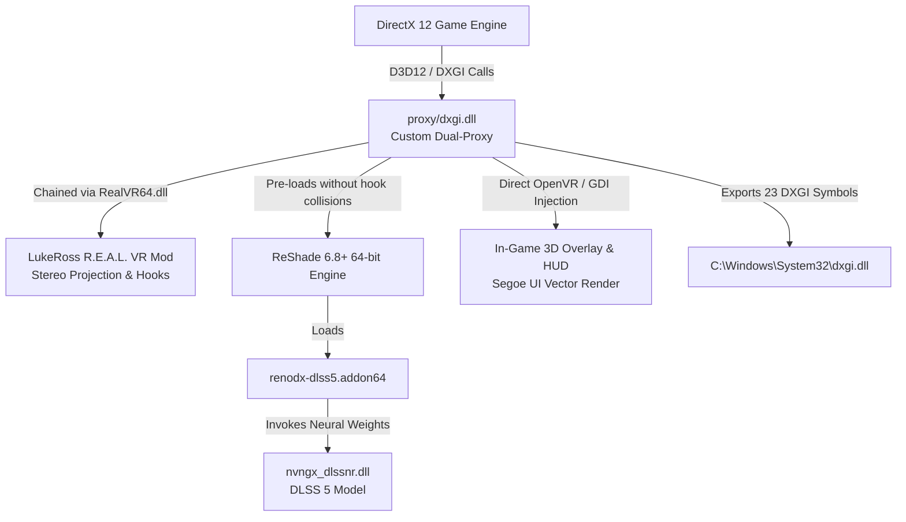

# DLSS 5 <> VR : Neural Reconstruction for LukeRoss R.E.A.L. VR

[](https://opensource.org/licenses/MIT)
[]()
[]()
[-orange.svg)]()

Universal C++ dual-proxy and automated toolchain bridging **NVIDIA DLSS 5 Neural Reconstruction** (ReShade 6.8+ Add-on & RenoDX) with **LukeRoss R.E.A.L. VR mods** (OpenXR / SteamVR).

---

## 🚀 Usage & How-To (Quick Start)

### For End-Users & Players

1. **Download**: Grab the latest **`DLSS5-VR-Release.zip`** from the [GitHub Releases](../../releases) tab.
2. **Extract**: Unzip the folder anywhere (e.g. `C:\tools\DLSS5-VR`).
3. **Run**: Launch **`VR-DLSS5-Installer.exe`** (no dependencies needed, 0% bloat, native Win32).
4. **Select Game**:
   - Drag & drop your game executable onto the window, or click **Browse...** to select it (e.g. `Cyberpunk2077.exe`, `afop.exe`).
   - *Note*: If you select an Unreal Engine launcher in the root folder, the installer automatically resolves the real target in `Binaries\Win64`.
5. **Install**: Click **Install / Update DLSS 5**.
   - If missing, the ~160 MB neural model (`nvngx_dlssnr.dll`) will be downloaded automatically with live progress.
   - The installer creates an idempotent, safe swap of LukeRoss's `dxgi.dll` -> `RealVR64.dll`.
6. **Play**: Launch your game normally with your VR headset connected!
7. **Rollback**: To restore vanilla LukeRoss VR at any time, click **Restore Vanilla LukeRoss**.

#### In-Game HUD & Controls

| Action | VR Controller | Keyboard |
| :--- | :--- | :--- |
| **Toggle HUD On/Off** | `Select / Back` + `L3` (Stick Click) | `Insert` |
| **Toggle DLSS 5 On/Off** | `Select` (in HUD) | `F6` |
| **Menu Navigation** | `D-Pad Up / Down` | `Up / Down Arrows` |
| **Adjust HUD Position** | Row `HUD Pos` (`Top` / `Bottom` / `World` / `Head`) | `Left / Right Arrows` |
| **ReShade Overlay** | — | `Home` |
| **LukeRoss VR Settings** | Dedicated VR button | `Numpad` |

---

## 🛠️ Developer Guide

### High-Level Architecture

The toolchain operates at the DirectX 12 and OpenVR boundaries:



#### Why a Dual-Proxy?
1. **Hook Collision Prevention**: LukeRoss's `RealVR64.dll` hooks DXGI swapchain creation and OpenVR presents. Loading ReShade standard `.dll` directly causes initialization deadlocks.
2. **Explicit Chaining**: Our `proxy/dxgi.dll` exports all 23 standard DXGI functions via [`proxy/proxy.def`](file:///C:/code/dlss5-vr/proxy/proxy.def), safely pre-loading ReShade in passive mode before forwarding control to `RealVR64.dll`.
3. **Stereo Frame Reconstruction**: Intercepts `NVSDK_NGX_D3D12_EvaluateFeature` calls to prevent memory desynchronization across dual-eye render passes.
4. **Zero Latency In-Game HUD**: Renders a vector-crisp Segoe UI overlay directly through OpenVR 3D overlays without introducing render pass latency.

---

### Prerequisites & Toolchain Setup

- **OS**: Windows 10/11 x64
- **Compiler**: Visual Studio 2022 (MSVC `cl.exe` v143+ with C++17 support)
  - Workload: *Desktop development with C++*
  - Ensure `cl.exe` is available in your PATH or run commands from the **x64 Native Tools Command Prompt for VS 2022**.
- **Optional**:
  - Go 1.22+ (for `vr-dlss5-patch` headless CLI)
  - Python 3.10+ (for live debugging scripts in `tools/`)

---

### Compiling from Source

#### 1. Build the Entire Release Package
The easiest way to build everything and produce the distributable `.zip`:
```cmd
cd C:\code\dlss5-vr
package_release.bat
```
Output will be generated in:
- `dist/DLSS5-VR-Release/` (unpacked directory)
- `dist/DLSS5-VR-Release.zip` (~3.8 MB standalone archive)

---

#### 2. Build Components Individually

##### A. Build the Dual-Proxy (`proxy/dxgi.dll`)
```cmd
cd C:\code\dlss5-vr\proxy
build.bat
```
*Build details*:
- Uses `/O2 /std:c++17 /LD /W3`.
- Links `openvr_api.lib`, `d3d12.lib`, `dxgi.lib`, `gdi32.lib`, `user32.lib`.
- Uses `proxy.def` for standard system export forwarding.

##### B. Build the Win32 GUI Installer (`installer/VR-DLSS5-Installer.exe`)
```cmd
cd C:\code\dlss5-vr\installer
build.bat
```
*Build details*:
- Lightweight Win32 GUI subsystem (`/SUBSYSTEM:WINDOWS`).
- Zero external runtime dependencies.
- Links `comctl32.lib` (v6 visual styles), `wininet.lib` (HTTP downloader & update checker), `shell32.lib` (drag & drop, file dialogs).

##### C. Build the Headless CLI (`vr-dlss5-patch`)
```cmd
cd C:\code\dlss5-vr\vr-dlss5-patch
go build -o vr-dlss5-patch.exe main.go
```

---

### Hot-Reload & Development Workflow

To rapidly test proxy modifications without restarting the installer:
1. Edit [`proxy/proxy.cpp`](file:///C:/code/dlss5-vr/proxy/proxy.cpp).
2. Recompile and deploy directly into your game directory using PowerShell:
```powershell
cd C:\code\dlss5-vr\proxy
.\build.bat
.\deploy.ps1 -GameDir "D:\Games\Avatar Frontiers of Pandora"
```
3. Run live diagnostics to monitor hooking, eye evaluation, and FPS:
```cmd
python tools/diag.py --poll 1.0
```
4. Stream ReShade and LukeRoss logs in real time:
```cmd
python tools/tail_log.py --game-dir "D:\Games\Avatar Frontiers of Pandora"
```

---

### Repository Layout

```
dlss5-vr/
├── installer/                     # Native Win32 GUI Installer (~190 KB)
│   ├── installer.cpp              # Win32 UI, WinINet downloader, safe swap engine
│   ├── build.bat                  # MSVC compilation script
│   └── README.md                  # Installer architecture & swap mechanics
│
├── proxy/                         # C++ Dual-Proxy (Core Runtime Component)
│   ├── proxy.cpp                  # DXGI hooks, OpenVR HUD, GDI Segoe UI, D3D12 uncap
│   ├── proxy.def                  # 23 DXGI standard exports
│   ├── openvr.h / openvr_api.dll  # Valve OpenVR SDK headers & 64-bit runtime
│   ├── build.bat                  # MSVC compile script -> dxgi.dll
│   ├── deploy.ps1                 # Fast hot-deploy PowerShell script
│   └── README.md                  # Proxy internals & thread model
│
├── deps/                          # Redistributable Helper Binaries
│   ├── ReShade64_dlss5.dll         # ReShade 6.8+ with neutralized OpenVR hooks
│   ├── renodx-dlss5.addon64       # RenoDX DLSS 5 add-on
│   ├── cudart64_12.dll            # NVIDIA CUDA 12 runtime
│   └── README.md
│
├── tools/                         # Developer Live Diagnostics (Python)
│   ├── diag.py                    # Process RAM hooks & injection inspector
│   ├── tail_log.py                # Dual log tailer (ReShade + LukeRoss)
│   ├── analyze_eval.py            # Profiler for stereo frame timings
│   ├── patch_workset.py           # Memory working set manager
│   └── README.md
│
├── vr-dlss5-patch/                # Headless Go CLI Automation Tool
│   ├── main.go, detector/, ...    # Go sources for CLI usage
│   └── README.md
│
├── package_release.bat            # Automated 1-click CI/CD packaging script (.zip)
├── VERSION                        # Current SemVer release (e.g. 1.0.0)
├── LICENSE                        # MIT License + Third-Party Notices
└── README.md                      # This document
```

---

### Safe Swap & Rollback Specification

The installer implements an idempotent swap pattern to safeguard LukeRoss installations:

| Stage | Action on `dxgi.dll` | Target File | State |
| :--- | :--- | :--- | :--- |
| **Vanilla LukeRoss** | Original LukeRoss DLL | `dxgi.dll` | Active |
| **First DLSS 5 Install** | Renamed to | `RealVR64.dll` | Chained backend |
| | Copied our proxy to | `dxgi.dll` | Active frontend |
| **Subsequent Updates** | `RealVR64.dll` untouched | `dxgi.dll` overwritten | Upgraded safely |
| **Restore Action** | Proxy removed | `RealVR64.dll` -> `dxgi.dll` | Vanilla restored |

---

### Update Checker Protocol

The installer checks for updates against GitHub:
- Endpoint: `https://raw.githubusercontent.com/eregnier/dlss5-vr/main/VERSION`
- Comparison: Uses standard semantic versioning (`major.minor.patch`).
- If newer: Prompts the user with `MB_YESNO`. Clicking **Yes** opens `https://github.com/eregnier/dlss5-vr/releases`. Clicking **No** cancels with zero side effects.

---

### Compatibility

- **Target Architecture**: 64-bit Windows PC games.
- **Graphics API**: DirectX 12 native (DirectX 11 supported via `dlss5-bridge.addon64`).
- **VR Runtimes**: SteamVR / OpenVR / OpenXR via LukeRoss R.E.A.L. VR.
- **Tested Hardware**: NVIDIA GeForce RTX 40 / 50 Series (RTX 5090 validated).
- **Supported Games**: Any DirectX 12 game supported by LukeRoss with native DLSS (*Avatar: Frontiers of Pandora*, *Cyberpunk 2077*, *Horizon Forbidden West*, *Spider-Man Remastered / Miles Morales*, *Ghost of Tsushima*, *Hogwarts Legacy*, *Star Wars Outlaws*, etc.).

---

### Legal & Distribution Notice

- This project is an independent open-source enabler and proxy.
- It is **NOT** affiliated with, endorsed by, or partnered with LukeRoss, NVIDIA, Valve, or Microsoft.
- This project does **NOT** contain, redistribute, or reverse-engineer any proprietary LukeRoss binaries or code. Users must independently obtain their own legitimate copy of LukeRoss R.E.A.L. VR mods directly from LukeRoss's official distribution channels (Patreon).
- Valve OpenVR SDK is licensed under the 3-Clause BSD License.
- ReShade and RenoDX are licensed under their respective open-source licenses.

### License

This project is licensed under the [MIT License](LICENSE).

---

*vibecoded with gemini 3.8 flash*

