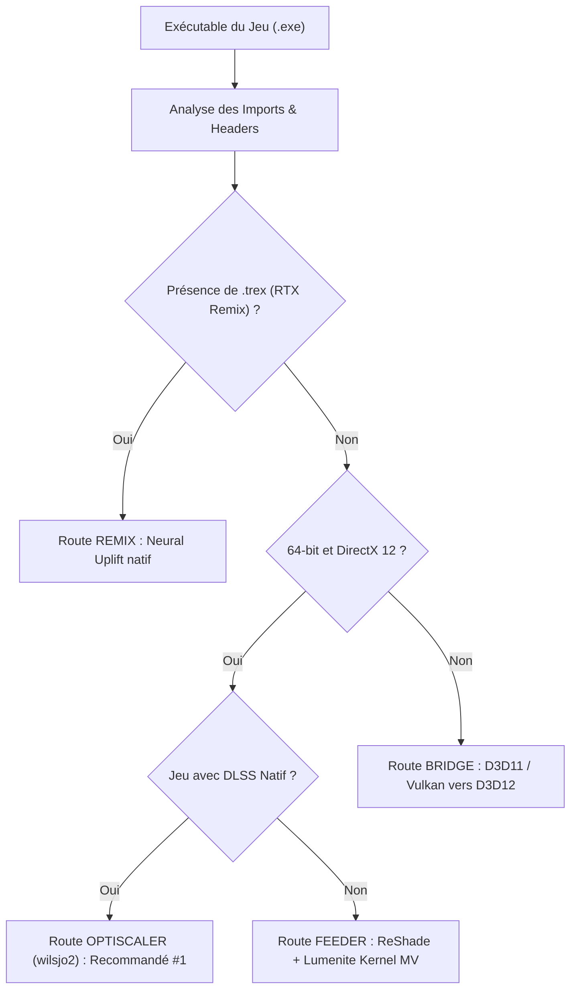

# 04. Analyse Technique d'Automatisation & Autotuning (DLSS 5 Autopilot)

Ce document analyse l'architecture de **DLSS 5 Autopilot** (`Kizzuwatnaa/DLSS5-Autopilot`), un orchestrateur autonome conçu pour automatiser le choix de routes, la gestion des architectures GPU et l'ajustement dynamique de framerate.

---

## 1. La Matrice des Architectures GPU & Binaires Cibles

L'un des apports majeurs de DLSS 5 Autopilot réside dans la détection matérielle précise et l'association des binaires de réseaux neuronaux adaptés au matériel.

| Famille GPU | Architecture | Binaire `nvngx_dlssnr.dll` Recommandé | Format de Précision | Comportement Relatif |
| :--- | :--- | :--- | :--- | :--- |
| **GeForce RTX 50** | Blackwell (`sm_90` / `sm_100`) | `310.8.0` officiel NVIDIA | **FP8 natif** | Performance maximale, latence Tensor minimale |
| **GeForce RTX 40** | Ada Lovelace (`sm_89`) | `310.8.0-RTX40` communautaire | **FP16 / FP8 Ada** | Très performant, support du MFG |
| **GeForce RTX 30** | Ampere (`sm_86`) | `310.8.SF-v2` ShortFuse | **FP16** | Coût modéré à élevé, `WorkingScale=0.75` impératif |
| **GeForce RTX 20** | Turing (`sm_75`) | `310.8.SF` ShortFuse | **FP16** | Lourd, `WorkingScale=0.50` conseillé |

### Validation de Signature Fatbin
Autopilot analyse les en-têtes PE et les sections `.nv_fatb` / `.nvFatBi` des binaires DLL pour vérifier la présence des micro-architectures avant déploiement. Cela évite le chargement d'un binaire Blackwell FP8 non supporté sur une carte Ada Lovelace ou Turing.

---

## 2. Le Modèle Mathématique d'Autotuning (`autotune.py`)

Au lieu de laisser l'utilisateur ajuster la résolution du modèle au hasard, Autopilot formalise la relation entre résolution et temps de calcul :

### A. La Formule Fondamentale
Le temps de frame total se sépare en une partie fixe (rendu moteur, logique CPU, swapchain) et une partie qui varie avec la surface du réseau de neurones :

$$\text{FrameTime}(r) = \text{Base} + k \cdot r^2$$

Où :
- $r$ est le ratio de résolution de travail (`WorkingScale` entre $0.25$ et $1.0$).
- $\text{Base}$ est le temps de rendu incompressible du jeu sans DLSS 5.
- $k$ est le coefficient de charge des cœurs Tensor.

### B. Résolution Analytique pour une Cible de FPS
À partir de deux sessions de jeu mesurées à deux résolutions différentes $r_1$ et $r_2$, le système résout le système linéaire à 2 inconnues pour trouver $\text{Base}$ et $k$.

Pour atteindre un framerate cible $T$ (ex: $T = 72\text{ FPS}$, soit un budget de $13,88\text{ ms}$) :
$$T_{\text{cible}} = \frac{1000}{T}$$
$$r_{\text{optimal}} = \sqrt{\frac{\frac{1000}{T} - \text{Base}}{k}}$$

### Application directe à notre projet VR :
Pour une RTX 5090 sur Cyberpunk en VR ($T = 72\text{ FPS}$, $T_{\text{cible}} = 13,88\text{ ms}$, $\text{Base} = 11,20\text{ ms}$, $k = 3,00\text{ ms}$) :
$$r = \sqrt{\frac{13,88 - 11,20}{3,00}} = \sqrt{\frac{2,68}{3,00}} = \sqrt{0,893} \approx \mathbf{0,94}$$
Avec une marge de sécurité de 10% pour absorber les pointes de charge dynamique :
$$r_{\text{sécurité}} = 0,94 \times 0,85 \approx \mathbf{0,80} \text{ (ou } \mathbf{0,75}\text{)}$$

---

## 3. Le Sélecteur de Routes Graphiques

Autopilot analyse la table d'import PE (`kernel32`, `d3d12.dll`, `dxgi.dll`, `vulkan-1.dll`) et détermine la route optimale :

Pour notre cas d'usage (Cyberpunk 2077, 64-bit, Direct3D 12, avec DLSS natif) :
- La route **OptiScaler** est classée **recommandation absolue #1**.
- L'approche ReShade (`renodx-dlss5`) est reléguée au second plan en raison de son surcoût et de son manque de flexibilité sur les vecteurs d'entrée.

---

## 4. Diagnostics Automatiques & Télémétrie

DLSS 5 Autopilot intègre un module de diagnostic post-lancement (`diagnose.py`) qui inspecte conjointement :
1. `OptiScaler.log` : Vérifie l'initialisation du modèle, la présence du forwarder, le mode Pre-SR et les timings Tensor.
2. `ReShade.log` : Détecte les conflits d'injection et de swapchain.
3. Les journaux d'événements Windows (`Application Error Event 1000`) : Identifie immédiatement les exceptions `0xC0000005` (Access Violation) liées aux conflits de proxies DLL.

Cette logique d'auto-diagnostic doit être intégrée dans notre outil d'installation et de monitoring VR.
