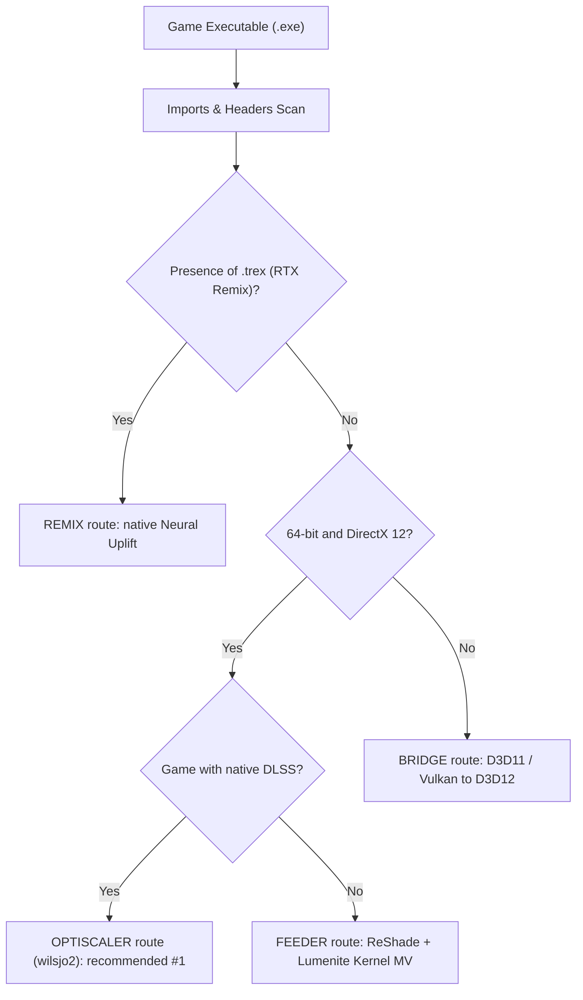

# 04. Technical Analysis of Automation & Autotuning (DLSS 5 Autopilot)

This document analyzes the architecture of **DLSS 5 Autopilot** (`Kizzuwatnaa/DLSS5-Autopilot`), an autonomous orchestrator designed to automate route selection, GPU architecture handling and dynamic frame-rate tuning.

---

## 1. The GPU Architecture & Target Binary Matrix

One of DLSS 5 Autopilot's main contributions is accurate hardware detection and matching neural network binaries to the hardware.

| GPU family | Architecture | Recommended `nvngx_dlssnr.dll` | Precision format | Relative behavior |
| :--- | :--- | :--- | :--- | :--- |
| **GeForce RTX 50** | Blackwell (`sm_90` / `sm_100`) | NVIDIA official `310.8.0` | **Native FP8** | Maximum performance, lowest Tensor latency |
| **GeForce RTX 40** | Ada Lovelace (`sm_89`) | Community `310.8.0-RTX40` | **FP16 / FP8 Ada** | Very fast, MFG support |
| **GeForce RTX 30** | Ampere (`sm_86`) | ShortFuse `310.8.SF-v2` | **FP16** | Moderate to high cost, `WorkingScale=0.75` mandatory |
| **GeForce RTX 20** | Turing (`sm_75`) | ShortFuse `310.8.SF` | **FP16** | Heavy, `WorkingScale=0.50` recommended |

### Fatbin Signature Validation
Autopilot analyzes PE headers and the `.nv_fatb` / `.nvFatBi` sections of DLL binaries to verify the presence of the micro-architectures before deployment. This avoids loading a Blackwell FP8 binary on an unsupported Ada Lovelace or Turing card.

---

## 2. The Autotuning Mathematical Model (`autotune.py`)

Instead of letting the user guess the model resolution, Autopilot formalizes the relationship between resolution and compute time:

### A. The Fundamental Formula
Total frame time separates into a fixed part (engine render, CPU logic, swapchain) and a part that varies with the neural network's surface area:

$$\text{FrameTime}(r) = \text{Base} + k \cdot r^2$$

Where:
- $r$ is the working resolution ratio (`WorkingScale` between $0.25$ and $1.0$).
- $\text{Base}$ is the game's incompressible render time without DLSS 5.
- $k$ is the Tensor Core load coefficient.

### B. Analytical Solution for an FPS Target
From two measured play sessions at two different resolutions $r_1$ and $r_2$, the system solves the 2-unknown linear system to find $\text{Base}$ and $k$.

To reach a target frame rate $T$ (e.g. $T = 72\text{ FPS}$, i.e. a $13.88\text{ ms}$ budget):
$$T_{\text{target}} = \frac{1000}{T}$$
$$r_{\text{optimal}} = \sqrt{\frac{\frac{1000}{T} - \text{Base}}{k}}$$

### Direct application to our VR project:
For an RTX 5090 in Cyberpunk VR ($T = 72\text{ FPS}$, $T_{\text{target}} = 13.88\text{ ms}$, $\text{Base} = 11.20\text{ ms}$, $k = 3.00\text{ ms}$):
$$r = \sqrt{\frac{13.88 - 11.20}{3.00}} = \sqrt{\frac{2.68}{3.00}} = \sqrt{0.893} \approx \mathbf{0.94}$$
With a 10% safety margin to absorb dynamic load spikes:
$$r_{\text{safety}} = 0.94 \times 0.85 \approx \mathbf{0.80} \text{ (or } \mathbf{0.75}\text{)}$$

---

## 3. The Graphics Route Selector

Autopilot analyzes the PE import table (`kernel32`, `d3d12.dll`, `dxgi.dll`, `vulkan-1.dll`) and determines the optimal route:

For our use case (Cyberpunk 2077, 64-bit, Direct3D 12, with native DLSS):
- The **OptiScaler** route is ranked **absolute recommendation #1**.
- The ReShade approach (`renodx-dlss5`) is relegated to second place because of its overhead and its lack of flexibility on input vectors.

---

## 4. Automatic Diagnostics & Telemetry

DLSS 5 Autopilot includes a post-launch diagnostic module (`diagnose.py`) that jointly inspects:
1. `OptiScaler.log`: checks model initialization, forwarder presence, Pre-SR mode and Tensor timings.
2. `ReShade.log`: detects injection and swapchain conflicts.
3. Windows event logs (`Application Error Event 1000`): immediately identifies `0xC0000005` (Access Violation) exceptions related to DLL proxy conflicts.

That self-diagnostic logic should be integrated into our VR installation and monitoring tool.
