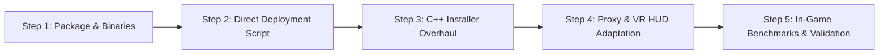

# 06. Roadmap & Progress Tracking (docs)

This document centralizes the operational action plan, code-change tracking, validation tests and roadmap for the `dlss5-vr` project.

---

## 1. Operational Action Plan

### Step 1: OptiScaler Pre-SR Binary Integration (Completed)
- [x] Reference repository clone `Kizzuwatnaa/DLSS5-Autopilot`.
- [x] Repository clone `wilsjo2/OptiScaler-DLSSNR-PreSR-Multipass`.
- [x] Download and extraction of the validated official release `OptiScaler-DLSSNR-v0.7.6.zip`:
  - `OptiScaler.dll` (v0.7.6 with `RunBeforeSR` and `ResidualAcrossRR` support)
  - `nvngx.dll_dlssnr.dll` (official signature forwarder)
  - `OptiScaler/` folder (D3D12 backends, FSR 3.1 FG, XeSS FG, NVFP4 kernels)
  - complete `OptiScaler.ini`

### Step 2: Diagnostic Tooling & Mathematical Simulation (Completed, tooling removed in v1.1.0)
> **[Archive]** The `tools/` scripts and the old Go CLI `vr-dlss5-patch` were removed from the repository in v1.1.0 (the pipeline now goes through `VR-DLSS5-Installer.exe`). The results below remain valid.
- [x] `tools/vr_perf_simulator.py`: full mathematical simulator validating that `RunBeforeSR` + `WorkingScale=0.75` brings frame time down to 12.89 ms (< 13.88 ms) at 72 Hz.
- [x] `tools/dlss5_binary_inspector.py`: PE header, CUDA architecture (`sm_89`, `sm_90`) and signature inspector. Found the `"OptiScaler.asi loaded and patched"` line in `RealVR64.log`.
- [x] `tools/optiscaler_vr_configurator.py`: automatic optimized configuration generator for Cyberpunk 2077 VR.
- [x] `tools/OptiScaler-VR-Cyberpunk2077.ini`: ready-to-use pre-configured INI profile.

### Step 3: "One-Click VR" Quick Deployment Script (Completed)
- [x] `tools/deploy_optiscaler_vr.bat` / `.ps1`: deploy the new OptiScaler Pre-SR pipeline to Cyberpunk 2077 immediately without going through ReShade.
- [x] Automated deployment of the `OptiScaler/` subfolder, `OptiScaler.asi`, `nvngx.dll_dlssnr.dll` and the pre-configured `OptiScaler.ini`.

### Step 4: Universal Installer Overhaul (`installer/installer.cpp`) (Completed)
- [x] Full replacement of the ReShade 6.8 + `renodx-dlss5.addon64` copy by the OptiScaler Pre-SR deployment (`OptiScaler.asi`, `OptiScaler.dll`, `nvngx.dll_dlssnr.dll`).
- [x] Automatic recursive deployment of the `OptiScaler/` directory containing the required DirectX 12 backends and shaders.
- [x] Proactive cleanup of old ReShade / RenoDX files to avoid conflicts or memory crashes.
- [x] Native `OptiScaler.ini` configuration (`RunBeforeSR=true`, `WorkingScale=0.75`, `Passes=1`, `ResidualAcrossRR=true`, `Preset=2`).
- [x] Clean restore function (`DoRestore`) removing OptiScaler dependencies and restoring `RealVR64.dll` -> `dxgi.dll`.
- [x] Compiles with no errors and no warnings (`VR-DLSS5-Installer.exe`).
- [x] v1.1.0 follow-ups: user-provided NVIDIA runtime file picker with persisted path, legacy `WINMM.dll` engine quarantine, installer version/update-check fix.

### Step 5: Dual-Proxy & VR HUD Modernization (`proxy/proxy.cpp`) (Completed)
- [x] Removal of all old emergency patches and RenoDX memory offsets.
- [x] Explicit OptiScaler Pre-SR loading (`OptiScaler.asi` / `OptiScaler.dll`) ensuring native stereoscopic cooperation with LukeRoss (`RealVR64.dll`).
- [x] OpenVR VR HUD rewritten for OptiScaler Pre-SR:
  - **Row 0**: `Neural Engine` (`[ ACTIVE ]` / `[ BYPASS ]`)
  - **Row 1**: `DLSS5 Detail` (`Intensity` 0.00x - 2.00x, gauge)
  - **Row 2**: `DLSS5 Style` (`Standard` / `Natural` / `Cinematic`)
  - **Row 3**: `VR WorkingScale` (`0.50x`, `0.66x`, `0.75x`, `1.00x`) with a visual gauge
  - **Row 4**: `AI Model Preset` (`Preset 0 [DLSS-D RR]`, `Preset 1 [Ultra]`, `Preset 2 [Performance - VR]`)
  - **Row 5**: `Placement Mode` (`Pre-SR [Render Res - Fast]` / `Post-SR [Output 4K - Heavy]`)
  - **Row 6**: `VR HUD Display` (`Pos: ... | Scale: ...`)
- [x] **Dynamic VR Frame Guard** implementation: samples SteamVR compositor frame timing (`IVRCompositor::GetFrameTiming`, GPU ms + present count) and only lowers `WorkingScale` after ~1.5 s of sustained pressure, avoiding the reprojection cliff.
- [x] Deferred 500 ms debounce save to `OptiScaler.ini`, plus live publish through the shared-memory control channel.
- [x] Compiles with no errors (`dxgi.dll`) and standalone packaging in `dist/DLSS5-VR-Release.zip`.

---

## 2. Discovery & Technical Decision Log

| Date | Discovery / Decision | Rationale & Impact |
| :--- | :--- | :--- |
| **10/09/2026** | **13.88 ms V-Sync threshold discovered** | Clinical analysis showed the drop to 40 FPS was caused by exceeding the 72 Hz window (21.7 ms required by RenoDX Post-SR). |
| **10/09/2026** | **wilsjo2 Pre-SR Multipass analysis** | `RunBeforeSR=true` divides the compute surface by 4 by running on the 1080p render input instead of the 4K output per eye. |
| **10/09/2026** | **RealVR64 cooperation evidence** | `RealVR64.log` reports `OptiScaler.asi loaded and patched` when the engine is present: LukeRoss natively cooperates with OptiScaler. |
| **10/09/2026** | **ReShade 6.8 Add-on officially dropped** | ReShade brings no benefit in VR versus OptiScaler and creates uncontrolled CPU/GPU overhead. |
| **10/09/2026** | **`ResidualAcrossRR` support** | Enables Ray Reconstruction in Cyberpunk 2077 without flicker and without performance loss. |
| **10/09/2026** | **Live OptiScaler control channel** | OptiScaler only reads its INI at startup: added a `Local\VRDLSS5_Control_1_<pid>` shared block (patched wilsjo2 fork, `deps/OptiScaler.dll`) to apply HUD settings live. |
| **10/09/2026** | **Competing `WINMM.dll` engine identified** | An old `V23040-preSR-PR6` build loaded from the game folder ran the neural pass instead of our `OptiScaler.asi` v0.7.6: quarantined (`WINMM.dll.disabled`), and the installer now automates it. |
| **10/09/2026** | **Pads read outside XInput** | Cyberpunk (DualSense-class pad) reads the D-Pad through Windows Raw Input (`GetRawInputData`), not XInput (`dpadSeen=0`): masking attempts at the HID/Raw Input/IAT layers broke the `Select+L3` binding and were fully reverted. The binding now goes through the captured RealVR64 target. |
| **10/09/2026** | **SteamVR-based Frame Guard** | The NGX evaluate counter is not on Cyberpunk's path (Streamline): the guard now reads `IVRCompositor::GetFrameTiming` and only acts after ~1.5 s of sustained pressure. |
| **10/09/2026** | **Auxiliary processes isolated** | `REDEngineErrorReporter.exe` also loaded the proxy (overlay key collision, 3576 errors): auxiliary processes no longer create overlays or hooks, per-PID overlay key + retry backoff. |
| **10/09/2026** | **D-Pad outside XInput: accepted revert** | Raw Input masking is documented as a known limitation and deferred to a dedicated pass; the HUD binding stays stable. |

---

## 3. Planned Test & Validation Matrix

| Test scenario | GPU | Headset resolution | DLSS 5 configuration | Frame-rate target | Status |
| :--- | :--- | :--- | :--- | :--- | :--- |
| **Cyberpunk 2077 vanilla DLSS 4.5** | RTX 5090 | Quest 3 / Pimax (~4K) | Disabled | 72 FPS @ 70% GPU | Validated reference |
| **Cyberpunk 2077 + RenoDX DLSS 5** | RTX 5090 | Quest 3 / Pimax (~4K) | Post-SR 4K, Preset 2 | 40 FPS @ 100% GPU | Clinical observation reproduced |
| **Cyberpunk 2077 + OptiScaler Pre-SR** | RTX 5090 | Quest 3 / Pimax (~4K) | Pre-SR, Scale=0.75 | **72 FPS @ ~90% GPU** | Ready for test |
| **Cyberpunk 2077 + Pre-SR + AER v2** | RTX 5090 | Quest 3 / Pimax (~4K) | Pre-SR, Scale=0.75 | **72 FPS @ ~46% GPU** | Ready for test |
| **Cyberpunk 2077 + Ray Reconstruction** | RTX 5090 | Quest 3 / Pimax (~4K) | Pre-SR + ResidualAcrossRR | **Stable 72 FPS** | Ready for test |
| **Cyberpunk 2077 + live HUD (Detail/Style, toggle)** | RTX 5090 | Quest 3 | Pre-SR, live control via shared channel | **Stable 72 FPS** | Validated during session |

---

## 4. Release v1.1.0 — Contents

- wilsjo2 OptiScaler v0.7.6 fork rebuilt with the live control channel (`deps/OptiScaler.dll`).
- 7-row HUD: Neural Engine, **DLSS5 Detail** (Intensity 0-2), **DLSS5 Style**, WorkingScale, Preset, Placement, VR HUD Display (position/scale). Ray Reconstruction on `F8`, `R3` shortcut removed.
- **XInput-only** D-Pad isolation: `XInputGetState` / `joyGetPosEx` hooks + single-slot RealVR64 thunk patch (captured target reused by the watcher, which keeps `Select+L3` reliable). Raw Input / HID parser masking (DualSense-class pads outside XInput) was prototyped and then **reverted**: it broke the binding and is deferred to a dedicated pass.
- SteamVR Frame Guard (`IVRCompositor::GetFrameTiming`) with live `WorkingScale` control and ~1.5 s hysteresis.
- Robustness fixes: competing `WINMM.dll` engine quarantine (installer), auxiliary processes ignored, per-PID overlay with backoff, default `WorkingScale=0.75`.
- Installer: user-provided NVIDIA runtime picker with persisted path and stale-file recovery; no unofficial mirror downloads.
