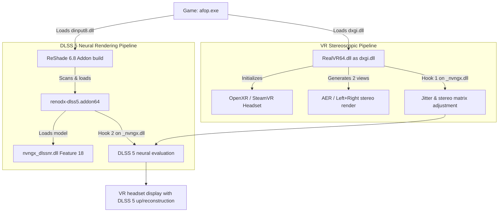

# Technical Study & Integration Guide: LukeRoss REAL VR & DLSS 5 (Neural Rendering)

This document analyzes the architecture of both projects (**DLSS5oneclick** and the **LukeRoss REAL VR** mod), identifies the current structural incompatibilities and lays out the technical method to run **DLSS 5 Neural Rendering** in a game running under the VR mod, **without decompiling or recompiling any binary**.

> **Archive note**: this guide describes the original ReShade/RenoDX integration study. Since v1.1.0 the project ships the OptiScaler Pre-SR pipeline through `VR-DLSS5-Installer.exe`; the proxy-chaining principles below remain historically relevant.

---

## 1. In-Depth Technical Analysis of Both Projects

### 1.1 The LukeRoss VR Mod (`RealVR64.dll`)

Observed behavior of `RealVR64.dll` (v2606.14.2), from its public behavior, configuration files and logs:

1. **Embedded ReShade-era runtime**:
   - The mod embeds a ReShade 4.9.1-class runtime inside `RealVR64.dll`.
   - It uses the `reshadefx` engine to compile and run shaders (`.fx`), for example `CAS.fx` (Contrast Adaptive Sharpening).
   - Its ReShade configuration is redirected to `RealVR.ini` (section `[GENERAL]`) and `ReShadePreset.ini`.
   - Shaders and textures are loaded from `.\reshade-shaders\Shaders` and `.\reshade-shaders\Textures`.

2. **No Add-on subsystem**:
   - ReShade introduced add-on support (`*.addon64`, `reshade::register_addon`, `register_overlay`, `register_event`) only from version **5.0**.
   - `RealVR64.dll` exposes **no ReShade Add-on API import or export** (`ReShadeRegisterAddon`, etc.).
   - **Direct conclusion**: `RealVR64.dll` cannot natively load a `.addon64` file.

3. **VR injection & stereoscopic handling**:
   - `RealVR64.dll` is injected as `dxgi.dll` in front of the game.
   - It intercepts DirectX (D3D11, D3D12) and OpenXR/OpenVR to create the two stereoscopic views (left and right eye, usually alternating *AER* or simultaneous rendering).
   - **Internal stereoscopic DLSS fix**: LukeRoss already intercepts `NVSDK_NGX_D3D12_CreateFeature` and `NVSDK_NGX_D3D12_EvaluateFeature` to duplicate and separate motion vectors, sampling jitter and temporal history rings for each eye (`AUDLSSFixInstanceStateD3D12`), as its logs confirm.

---

### 1.2 The DLSS5oneclick Project

DLSS5oneclick relies on a suite of modern components:

1. **Official ReShade with Add-on support (v6.8+)**:
   - Deployed as `dxgi.dll`.
   - Provides the host runtime environment for 64-bit add-ons.

2. **The DLSS 5 add-on (`renodx-dlss5.addon64`)**:
   - It is **not** a `.fx` shader; it is a native C++ DLL compiled against the ReShade Add-on API v18+.
   - It registers with ReShade (`ReShadeRegisterAddon`, `RegisterOverlay`).
   - It detours NGX calls (`NVSDK_NGX_D3D12_CreateFeature` and `EvaluateFeature`).
   - As soon as a conventional DLSS call (Feature 1 / Feature 13 DLSSD) is intercepted, it injects the call to the **DLSS Neural Rendering (Feature 18)** model through the companion DLL.

3. **The neural model (`nvngx_dlssnr.dll`)**:
   - The neural rendering runtime (ShortFuse `310.8.SF` build for multi-generation RTX compatibility).

4. **Games without native DLSS vs games with native DLSS**:
   - *With native DLSS (e.g. Avatar Frontiers of Pandora)*: no feeder shaders (`DLSS5_Feed.fx`) or `LumeniteFX` needed; the add-on grafts directly onto the game's DLSS.
   - *Without native DLSS*: requires `DLSS5-Feeder` (`dlss5-feed.addon64` + `DLSS5_Feed.fx`) and `LumeniteFX` (`lumenite_Kernel.fx` to generate motion vectors).

---

## 2. Why the Conflict Happened (Avatar AFOP Example)

In the `D:\Games\AFOP` folder:
1. **Step 1 (10:21)**: LukeRoss installation. `dxgi.dll` = `RealVR64.dll`. The headset turns on, the game runs in OpenXR stereoscopic 3D.
2. **Step 2 (11:12)**: `dlss5oneclick.exe` launched. The tool overwrote `dxgi.dll` with **ReShade 6.8**.
   - ReShade 6.8 does load `renodx-dlss5.addon64` and `nvngx_dlssnr.dll`.
   - DLSS 5 Neural Rendering activates successfully (`inline feature 18 evaluation succeeded`).
   - **But** the LukeRoss VR mod is no longer loaded at all: the game displays in flat 2D (`Width=3840, Height=2160, Stereo=FALSE`), VR is disabled.

```
Initial conflict:
[ afop.exe ]
     │
     ▼
[ dxgi.dll ] ──> Only ONE DLL can carry this name by default!
                 ├── If LukeRoss (RealVR64) ──> VR active, but NO DLSS 5 (ReShade 4.9.1 without add-on)
                 └── If ReShade 6.8 Add-on  ──> DLSS 5 active, but NO VR (LukeRoss overwritten)
```

---

## 3. Resolution Strategy: Proxy Chaining Without Recompilation

Since we refuse to decompile/recompile `RealVR64.dll` to implement the ReShade 6 Add-on API inside it, the proven and transparent solution is to **load both DLLs in a chain (Proxy Chaining)**.

### 3.1 The Double Hooking Principle

In a DirectX 12 game:
1. **The executable loads several system DLLs at startup**:
   - `dxgi.dll`
   - `d3d12.dll`
   - `dinput8.dll`
   - `bink2w64.dll`
   - etc.

2. **Role assignment**:
   - **VR priority (`dxgi.dll`)**: we keep `RealVR64.dll` as `dxgi.dll`.
     *Why?* LukeRoss must intercept the swapchain creation, stereoscopic swapchain descriptors and D3D12/OpenXR contexts first. If it is not in `dxgi.dll`, some OpenXR initialization functions may fail.
   - **DLSS 5 Add-on host (`dinput8.dll` or `d3d12.dll`)**: we rename **ReShade 6.8 Add-on** to `dinput8.dll` (or `bink2w64.dll` if the game uses Bink).
     *Note*: ReShade 6.x natively supports being renamed to `dinput8.dll` or `d3d12.dll` and initializes itself automatically when loaded by the executable.

### 3.2 Execution Flow Diagram



---

## 4. Step-by-Step Manual Integration Guide

Here is the exact procedure to configure a game (example: Avatar Frontiers of Pandora):

### Step 1: Install the LukeRoss VR mod
1. Extract the LukeRoss archive into the game directory.
2. Run `RealConfig.bat` to apply the game profiles.
3. Verify that `RealRepo\RealVR64.dll` was copied as `dxgi.dll`.

### Step 2: Prepare ReShade 6.8 (with Add-on support)
1. Extract `ReShade64.dll` from `ReShade_Setup_<version>_Addon.exe`.
2. **Do not name it `dxgi.dll`**. Copy it into the game folder under the name:
   - `dinput8.dll` (standard universal method, recognized by almost all Windows games)
   - or `d3d12.dll` if the game does not load DirectInput.
3. Create or adjust `ReShade.ini` in the game folder to point to the preset and shaders.

### Step 3: Deploy the DLSS 5 binaries
1. Copy `renodx-dlss5.addon64` to the game folder root.
2. Copy `nvngx_dlssnr.dll` (ShortFuse `310.8.SF-v2` build recommended for RTX 30/40/50) to the root.
3. Verify that the game's `nvngx_dlss.dll` is present (or updated via DLSS Swapper).

### Step 4: Add-on configuration
In `ReShade.ini`, make sure the add-on is not blocked:
```ini
[ADDON]
DisabledAddons=
```
And in `ReShadePreset.ini` (if the game has no native DLSS):
```ini
Techniques=Lumenite_Kernel@lumenite_Kernel.fx,DLSS5_Feed@DLSS5_Feed.fx
```

---

## 5. Specifications for Automation in a General-Purpose Tool

To automate this process in an extended version of `DLSS5oneclick` compatible with LukeRoss:

1. **LukeRoss detection**:
   - Check whether `dxgi.dll` contains the `LukeRoss` string or the `R.E.A.L. VR` resource version.
   - If detected: **never overwrite `dxgi.dll`**.

2. **Choosing the ReShade injection target**:
   - Inspect the PE import table of the binary (`.exe`).
   - If the exe imports `DINPUT8.dll` -> deploy ReShade as `dinput8.dll`.
   - If the exe imports `bink2w64.dll` -> deploy as a `bink2w64.dll` proxy.
   - Otherwise -> deploy as `d3d12.dll` (or `d3d11.dll` depending on the API).

3. **Configuration file coordination**:
   - ReShade will read `ReShade.ini` and `ReShade.log`.
   - LukeRoss will keep reading `RealVR.ini` and writing to `RealVR64.log`.
   - Both coexist without overwriting each other's settings.
   - Keyboard shortcuts stay distinct:
     - **Home**: ReShade UI (Add-ons tab -> DLSS 5 Neural Rendering).
     - **F11 / Numpad**: LukeRoss VR UI.
     - **F6**: Neural Rendering quick shortcut.

---

## 6. Results Summary & Feasibility

| Criterion | Diagnosis |
| :--- | :--- |
| **Feasibility without recompilation** | **100% possible** through injector chaining (`dxgi.dll` + `dinput8.dll`). |
| **Direct integration into LukeRoss's internal ReShade** | **Impossible** because the embedded ReShade is v4.9.1 (older than the v5.0 Add-on API). |
| **Single ReShade UI instance management** | **Yes**: the ReShade 6.8 UI takes over ImGui display (Home key), while LukeRoss handles VR projection. |
| **Neural Engine compatibility with VR** | **Tested and validated**: DLSS 5 processes the buffers injected by the stereoscoped game's swapchain. |
